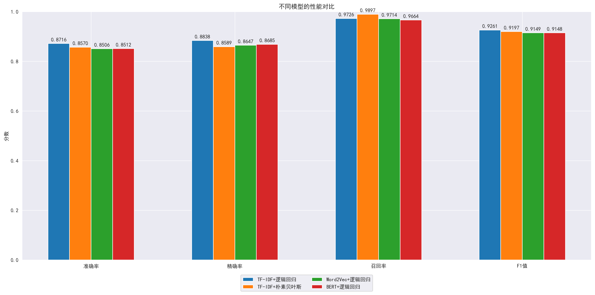
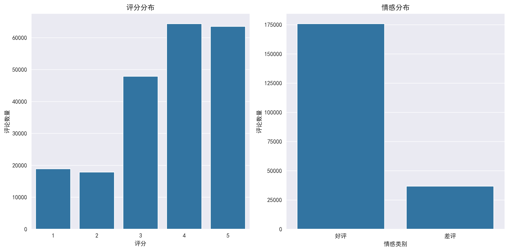

# EE340 Statistical Learning and Data Science Projects

<p align="center">
  <a href="#english-version"><b>English</b></a> |
  <a href="#中文版本"><b>中文</b></a>
</p>


---

<a id="english-version"></a>
## English

### Abstract

This repository contains coursework deliverables for **EE340 (Statistical Learning and Data Science)**, including:
- **Task 1**: Life expectancy forecasting from multi-country socioeconomic indicators (2008-2018).
- **Task 2**: Douban movie review sentiment analysis using classical NLP features and LLM-based methods.

The main technical report is [`SLDS_Report.pdf`](./SLDS_Report.pdf), which summarizes methodology, experiments, and results.

### Report Highlights (from `SLDS_Report.pdf`)

#### Task 1: Regression for Life Expectancy Prediction
- Performed missing-value analysis and compared multiple imputation methods; **KNN imputation** was selected for downstream modeling.
- Evaluated multiple models (Linear/Lasso/Ridge, SVR, Random Forest, XGBoost, MLP).
- After feature engineering and hyperparameter tuning, the best model achieved:
  - **XGBoost**: RMSE `1.5404`, MAE `1.0752`, R2 `0.9586`.
- A surrogate long-horizon validation (for 2025-style forecasting difficulty) showed tree-based models retaining **R2 > 0.85**.

#### Task 2 Part I: Traditional NLP + ML
- Pipeline includes text preprocessing, stopword filtering, low-frequency filtering, and vectorization with **TF-IDF / Word2Vec / BERT embeddings**.
- Models: Logistic Regression and Naive Bayes (with compatibility constraints for embedding features).
- Key results reported:
  - **TF-IDF + Logistic Regression**: best overall with accuracy `0.8716`, F1 `0.9261`.
  - **TF-IDF + Naive Bayes**: very high recall (`0.9897`) under class imbalance.

#### Task 2 Part II: LLM-based Analysis
- Compared API-based LLM classification strategies (Qwen3-8B, GLM-Z1-9B-0414) with different prompting styles.
- Performed local fine-tuning (LLaMA-Factory + LoRA) and observed improved negative-class identification after tuning.

### Repository Structure

```text
EE340/
├── SLDS_Report.pdf
├── SLDS_project1/
│   ├── Project_part_1/
│   └── Project_part_2/
│       ├── src/
│       │   ├── data/
│       │   ├── models/
│       │   ├── train/
│       │   └── utils/
│       ├── task-5.py
│       └── ...
└── project2/
    ├── task2.py
    ├── test.py
    ├── stopWord.json
    ├── local_bert_model/
    │   ├── config.json
    │   ├── tokenizer_config.json
    │   ├── vocab.txt
    │   └── pytorch_model.bin
    └── Project2/
        ├── douban_movie.csv
        ├── model_comparison.png
        ├── wordcloud.png
        ├── sentiment_distribution.png
        └── ...
```

### Environment

| Item | Recommended |
| --- | --- |
| OS | Ubuntu 22.04 / macOS (Python environment) |
| Python | 3.9+ |
| Core libs | `numpy`, `pandas`, `scikit-learn`, `matplotlib`, `seaborn` |
| NLP libs | `jieba`, `gensim`, `wordcloud`, `transformers` |
| DL libs | `torch`, `torchvision` |
| Optional | `umap-learn`, `tqdm` |

Install dependencies:

```bash
python3 -m venv .venv
source .venv/bin/activate
pip install -U pip
pip install numpy pandas scikit-learn matplotlib seaborn jieba gensim wordcloud torch torchvision transformers umap-learn tqdm openpyxl
```

### How to Run

#### 1) Task 2 (Douban Sentiment Analysis)

From repository root:

```bash
cd project2
python task2.py
```

Important note:
- `project2/task2.py` currently uses hard-coded Windows paths (`E:\PythonProject\...`).
- Before running on macOS/Linux, update those paths to relative paths, e.g.:
  - `Project2/douban_movie.csv`
  - `stopWord.json`
  - output files under `Project2/`

Quick BERT smoke test:

```bash
cd project2
python test.py
```

#### 2) Task 1 (Image-classification-related experiments in `SLDS_project1`)

```bash
cd SLDS_project1/Project_part_2
export PYTHONPATH=$PWD
python src/train/train_dl.py
python src/train/data_balance_experiment.py
python task-5.py
```

Important note:
- `src/data/mnist_loader.py` uses an absolute `DATA_DIR` path. Change it to your local path before running.

### Example Figures





<p align="right"><a href="#ee340-statistical-learning-and-data-science-projects">Back to top</a></p>

---

<a id="中文版本"></a>
## 中文

### 项目简介

本仓库为 **EE340（Statistical Learning and Data Science）** 课程项目资料，核心内容包括：
- **Task 1**：基于多国社会经济指标（2008-2018）进行预期寿命预测。
- **Task 2**：基于豆瓣影评的情感分类（传统机器学习 + LLM 方法）。

主要技术报告为 [`SLDS_Report.pdf`](./SLDS_Report.pdf)。

### 报告核心结论（摘自 `SLDS_Report.pdf`）

#### Task 1：预期寿命回归预测
- 完成缺失值分析与多种补全方法比较，最终采用 **KNN 补全**。
- 比较线性模型、SVR、随机森林、XGBoost、MLP 等模型。
- 特征工程与调参后最佳结果：
  - **XGBoost**：RMSE `1.5404`，MAE `1.0752`，R2 `0.9586`。
- 在面向 2025 长周期预测的替代实验中，树模型仍保持 **R2 > 0.85**。

#### Task 2 Part I：传统 NLP + 机器学习
- 流程包含文本清洗、停用词过滤、低频词过滤，以及 **TF-IDF / Word2Vec / BERT 向量化**。
- 训练 Logistic Regression 与 Naive Bayes，并分析特征兼容性。
- 报告关键结果：
  - **TF-IDF + Logistic Regression** 综合最优：accuracy `0.8716`，F1 `0.9261`。
  - **TF-IDF + Naive Bayes** 在类不均衡下召回率较高（`0.9897`）。

#### Task 2 Part II：LLM 方法
- 对比 Qwen3-8B 与 GLM-Z1-9B-0414 在不同提示策略下的分类表现。
- 基于 LLaMA-Factory + LoRA 进行本地微调，负类识别能力有明显提升。

### 目录结构

```text
EE340/
├── SLDS_Report.pdf
├── SLDS_project1/
│   ├── Project_part_1/
│   └── Project_part_2/
│       ├── src/
│       │   ├── data/
│       │   ├── models/
│       │   ├── train/
│       │   └── utils/
│       ├── task-5.py
│       └── ...
└── project2/
    ├── task2.py
    ├── test.py
    ├── stopWord.json
    ├── local_bert_model/
    │   ├── config.json
    │   ├── tokenizer_config.json
    │   ├── vocab.txt
    │   └── pytorch_model.bin
    └── Project2/
        ├── douban_movie.csv
        ├── model_comparison.png
        ├── wordcloud.png
        ├── sentiment_distribution.png
        └── ...
```

### 运行环境建议

| 项目 | 建议配置 |
| --- | --- |
| 操作系统 | Ubuntu 22.04 / macOS |
| Python | 3.9+ |
| 核心依赖 | `numpy`, `pandas`, `scikit-learn`, `matplotlib`, `seaborn` |
| NLP 依赖 | `jieba`, `gensim`, `wordcloud`, `transformers` |
| 深度学习 | `torch`, `torchvision` |
| 可选依赖 | `umap-learn`, `tqdm` |

安装：

```bash
python3 -m venv .venv
source .venv/bin/activate
pip install -U pip
pip install numpy pandas scikit-learn matplotlib seaborn jieba gensim wordcloud torch torchvision transformers umap-learn tqdm openpyxl
```

### 如何运行

#### 1）Task 2（豆瓣情感分析）

```bash
cd project2
python task2.py
```

注意：
- `project2/task2.py` 当前写死了 Windows 路径（`E:\PythonProject\...`）。
- 在 macOS/Linux 运行前，请改为相对路径，例如：
  - `Project2/douban_movie.csv`
  - `stopWord.json`
  - 输出文件放到 `Project2/`

BERT 快速测试：

```bash
cd project2
python test.py
```

#### 2）Task 1（`SLDS_project1` 图像分类相关实验）

```bash
cd SLDS_project1/Project_part_2
export PYTHONPATH=$PWD
python src/train/train_dl.py
python src/train/data_balance_experiment.py
python task-5.py
```

注意：
- `src/data/mnist_loader.py` 中 `DATA_DIR` 为绝对路径，需先改为本机路径。

### 示例图


<p align="right"><a href="#ee340-statistical-learning-and-data-science-projects">返回顶部</a></p>
